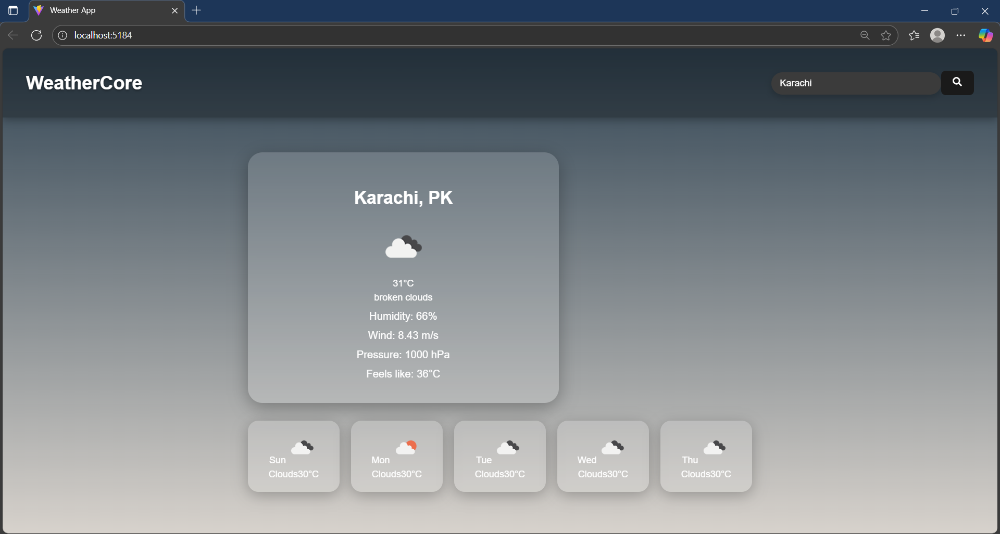

# WeatherCore

A clean and responsive weather application built with React that displays real-time weather and a multi-day forecast.

## 🚀 Live Demo

[View Live Demo](https://serene-pastelito-0b2b45.netlify.app/)

**Note:** The application's live demo may take a few hours to display weather data as the API key activates.

## ✨ Features

-   **Current Weather:** Displays real-time weather information for a searched city, including temperature, humidity, and wind speed.
-   **5-Day Forecast:** Provides a daily forecast for the next five days, helping users plan ahead.
-   **Dynamic Backgrounds:** The application's background changes dynamically to match the current weather conditions (e.g., sunny, cloudy, rainy).
-   **Responsive Design:** Optimized for a seamless experience on both desktop and mobile devices.

## 📸 Screenshot

## 📸 Screenshot




## 💻 Tech Stack

-   **Framework:** React
-   **Bundler:** Vite
-   **API:** OpenWeatherMap API
-   **Styling:** Custom CSS

## 🛠️ Getting Started

Follow these instructions to get a copy of the project up and running on your local machine.

### Prerequisites

You need to have Node.js and npm installed on your computer.

### Installation

1.  **Clone the repository:**
    ```bash
    git clone [https://github.com/syedaaniba/WeatherCore.git](https://github.com/syedaaniba/WeatherCore.git)
    ```
2.  **Navigate to the project directory:**
    ```bash
    cd WeatherCore
    ```
3.  **Install dependencies:**
    ```bash
    npm install
    ```
4.  **Set up your environment variables:**
    -   Create a new file named `.env` in the root of the project.
    -   Go to [OpenWeatherMap](https://home.openweathermap.org/api_keys), sign up for an account, and get your API key.
    -   Add the following line to your `.env` file, replacing `YOUR_API_KEY` with your actual key:
    ```
    VITE_WEATHER_KEY=YOUR_API_KEY
    ```
    -   Note: It can take a few hours for a new API key to become active.

5.  **Run the development server:**
    ```bash
    npm run dev
    ```

The application will be available at `http://localhost:5173`.
